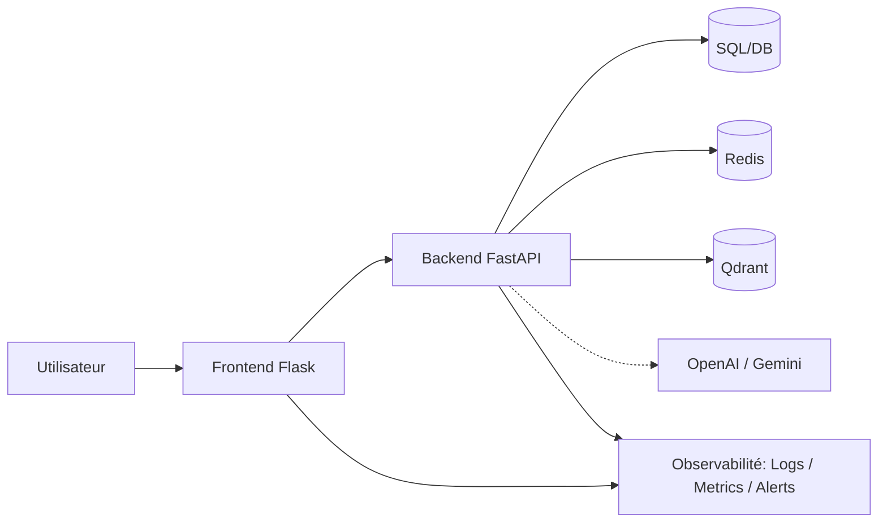

# 🚀 Blog Data & IA — Portfolio & Articles

[](https://smdlabtech.github.io/)
[](https://jekyllrb.com/)
[](LICENSE)

**Blog et portfolio** : Data Science, Business Intelligence, IA & Technologies.  
Contenu informatif, tutoriels et retours d’expérience.

---


## ✨ En bref

- **Site en ligne** : [https://smdlabtech.github.io/](https://smdlabtech.github.io/)
- **Stack** : **Backend FastAPI** (API REST) + **Frontend Flask** (templates) — voir `backend/` et `frontend/`. **Jekyll + Flask monolith** : sources dans `backend/app/` (migration depuis l’ancien dossier `app/` à la racine).
- **Contenu** : articles par catégories (Data Science, IA, Data Analytics, BI, Data Engineering), newsletter, recherche

**Ports en local : Backend → 8080** (http://localhost:8080/docs · http://localhost:8080/health) **· Frontend → 3000** (http://localhost:3000). Tout lancer d’un coup : `./scripts/dev/run-all.sh` ou `make run-all`.

### Composants et ports (en local)

| Rôle | Dossier | Port | Commande |
|------|---------|------|----------|
| **Frontend (site statique)** | `backend/app/` (Jekyll) | **4000** | `make run-jekyll` ou `cd backend/app && bundle exec jekyll serve` |
| **Frontend (UI Flask)** | `frontend/` | **3000** | `./scripts/dev/run-frontend.sh` ou `make run-frontend` (après backend) |
| **Backend API** | `backend/` (FastAPI) | **8080** | `./scripts/dev/run-backend.sh` ou `make run-backend` |
| **Backend monolith (Flask)** | `backend/app/` (run.py + package `src/`) | **8080** | `./scripts/dev/launch_app.sh` ou `make run-flask` |

**Backend (port 8080)** : API → http://localhost:8080/docs · Health → http://localhost:8080/health

Le **frontend** au sens « ce que voit l’utilisateur » peut être : (1) le site Jekyll sur le **port 4000** (`backend/app/`), ou (2) l’app Flask dans **`frontend/`** sur le **port 3000** (elle appelle le backend FastAPI sur 8080).

---

## 🎯 Points forts du repo

| Domaine | Détail |
|--------|--------|
| **Performance** | CSS/JS en bundles, PWA (Service Worker), lazy loading |
| **Qualité** | Tests pytest, pre-commit (black, flake8, isort), CI unifiée |
| **Observabilité** | Prometheus, Grafana, health checks, métriques |
| **DX** | Script de test avant prod, docs centralisées dans `docs/` |
| **Sécurité** | Headers OWASP, CORS configurable, rate limiting |

---

## 🏗 System Design

### Architecture globale

- **Frontend plateforme** : Flask dans `frontend/` (templates + assets), consommant le backend via `BACKEND_URL`.
- **Backend API** : FastAPI dans `backend/` (`/api/v1/*`, `/health`, `/metrics`, rate limit multi-tier).
- **Legacy statique** : Jekyll/Flask historique dans `backend/app/` conservé pour compatibilité.
- **Données** : YAML canonique dans `backend/data/` + DB optionnelle selon environnement.
- **Stores externes optionnels** : Redis (cache/rate limit), Qdrant (vector search), DB relationnelle.
- **IA** : intégration possible OpenAI/Gemini via services backend.
- **Observabilité** : Prometheus + Grafana + Loki + Alertmanager + health checks.

### Sécurité

- **Auth** : pas d’auth utilisateur côté site public ; API protégée par rate limiting et CORS.
- **Secrets** : variables d’environnement (`.env` en dev), Secret Manager en prod (Cloud Run). Pas de clés en dur.
- **CORS** : configurable via `CORS_ORIGINS` (liste de domaines en prod, `*` en dev).

### Observabilité

- **Logs** : niveau configurable (`LOG_LEVEL`), corrélation possible via `request_id` / `correlation_id` si ajouté au middleware.
- **Métriques** : endpoint `/metrics` (Prometheus). Health : `/health`, `/health/ready`, `/health/live`.
- **CI** : job summaries (build, tests, deploy), étape « Context debug » (workflow_dispatch avec `debug: true`), artefacts (coverage, trivy).

### Déploiement

- **Frontend** : GitHub Actions (Jekyll build → GitHub Pages).
- **Backend** : GitHub Actions (Docker build → GHCR ou Artifact Registry → Cloud Run). Rollback automatique si health check échoue.

### Checklists

- **Run locally**
  - Backend FastAPI : `./scripts/dev/run-backend.sh` (8080)
  - Frontend UI : `./scripts/dev/run-frontend.sh` (3000)
  - Run-all : `./scripts/dev/run-all.sh` (attend `/health`)
- **Deploy**
  - définir `GCP_PROJECT_ID` + `GCP_REGION` (variables Actions)
  - secrets prod : `SECRET_KEY`, `DATABASE_URL`
- **Troubleshooting**
  - port occupé : `./shut-down-all-ports.sh`
  - backend down : `curl -f http://localhost:8080/health`
  - gettext i18n (legacy Flask) :
    - `./scripts/i18n/validate_translations.sh . backend/app/translations`
    - `./scripts/i18n/compile-translations.sh backend/app/translations`



---

## 📁 Structure

```
├── backend/             # FastAPI — API REST (un seul backend, port 8080)
│   ├── main.py         # Point d'entrée : uvicorn backend.main:app
│   ├── config.py
│   ├── routers/        # health, api_v1 (articles, projects, experiences)
│   └── app/            # Legacy (Flask + Jekyll) — voir docs/MERGE_BACKEND_BACKEND_OLD.md
├── frontend/            # Flask — pages et templates (appelle le backend)
│   ├── app.py
│   ├── templates/
│   └── static/
├── backend/app/         # Legacy conservé : Jekyll + Flask (run.py + src/)
│   ├── _config.yml      # Jekyll
│   ├── src/             # Flask legacy
│   └── ...
├── scripts/             # dev, quality, build, i18n, ops, lib (voir scripts/README.md)
├── tests/               # Pytest
├── docs/                # CONTRIBUTING, MIGRATION_FASTAPI_FLASK, etc.
└── .github/workflows/   # CI/CD
```

Voir **[docs/MIGRATION_FASTAPI_FLASK.md](docs/MIGRATION_FASTAPI_FLASK.md)** pour la migration Backend FastAPI + Frontend Flask. Fusion **backend + backend_old** : [docs/MERGE_BACKEND_BACKEND_OLD.md](docs/MERGE_BACKEND_BACKEND_OLD.md). Comparaison **backend/app** vs **backend/app/src** : [docs/COMPARAISON_BACKEND_APP_SRC.md](docs/COMPARAISON_BACKEND_APP_SRC.md).

---

## 🧪 Lancer en local

### Backend FastAPI + Frontend Flask (nouvelle architecture)

```bash
# Terminal 1 — Backend API (port 8080)
pip install -r backend/requirements.txt
uvicorn backend.main:app --reload --port 8080

# Terminal 2 — Frontend (port 3000)
pip install -r frontend/requirements.txt
export BACKEND_URL=http://localhost:8080
flask --app frontend.app run --port 3000
# → http://localhost:3000
```

### Stack legacy (backend/app/)

```bash
# Tests + build Jekyll (legacy)
./backend/app/scripts/test-local.sh

# Site Jekyll
cd backend/app && bundle install && bundle exec jekyll serve
# → http://localhost:4000

# Flask monolith (backend/app/)
./scripts/dev/launch_app.sh
# → http://localhost:8080
```

**Makefile** : `make help` pour lister les cibles ; ex. `make setup`, `make test`, `make run-flask`, `make run-jekyll`, `make validate-i18n`, `make health`.

**Environnement** : copier `env.example` en `.env` si vous utilisez Flask. Voir [docs/ENV_VARIABLES.md](docs/ENV_VARIABLES.md).

---

## ✅ Checklist

| Contexte | Action |
|----------|--------|
| **Run locally** | `./scripts/dev/setup_complete.sh` puis `./scripts/dev/launch_app.sh` (Flask) ; ou `./scripts/build/launch_jekyll.sh --livereload` (Jekyll). |
| **Tests** | `make test` (Flask) ; `PYTHONPATH=. python3 -m pytest tests/test_backend_fastapi.py -v` (backend FastAPI). |
| **Deploy** | Push sur `main` déclenche CI (tests Flask + backend, build Jekyll, deploy Pages + optionnellement build Docker / Cloud Run). Voir [.github/workflows](.github/workflows). |
| **Troubleshooting** | Vérifier `.env`, `instance/`, logs Flask. Health : `curl http://localhost:8080/health`. Traductions : `./scripts/i18n/validate_translations.sh`. Rate limit : `curl http://localhost:8080/api/rate-limit`. |

---

## 📖 À propos

**Daya** — Data scientist, passionné par le foot et le basket.  
Partage de la programmation en **Python**, **R**, **SQL**, **Power BI** et **Excel VBA**.

---

## 📚 Documentation

Section centralisée pour inventorier **tous les fichiers Markdown (`.md`) du dépôt** (hors `.venv`, dépendances installées et caches locaux).

Inventaire **compact** pour lecture rapide. L'inventaire exhaustif est dans `docs/MARKDOWN_INVENTORY.md`.

Inventaire complet maintenu dans `docs/MARKDOWN_INVENTORY.md`.

| N° | Nom fichier | Description | Emplacement |
|---:|---|---|---|
| 1 | `CODE_OF_CONDUCT.md` | Code de conduite | [`CODE_OF_CONDUCT.md`](CODE_OF_CONDUCT.md) |
| 2 | `README.md` | Documentation principale du projet | [`README.md`](README.md) |
| 3 | `README.md` | README du dossier `backend` | [`backend/README.md`](backend/README.md) |
| 4 | `README.md` | README du dossier `backend/public` | [`backend/public/README.md`](backend/public/README.md) |
| 5 | `README.md` | README du dossier `backend/public/cv` | [`backend/public/cv/README.md`](backend/public/cv/README.md) |
| 6 | `README.md` | README du dossier `backend/src` | [`backend/src/README.md`](backend/src/README.md) |
| 7 | `about.md` | about | [`backend/src/about.md`](backend/src/about.md) |
| 8 | `privacy.md` | privacy | [`backend/src/privacy.md`](backend/src/privacy.md) |
| 9 | `business-intelligence.md` | Page tag/catégorie | [`backend/src/tags/business-intelligence.md`](backend/src/tags/business-intelligence.md) |
| 10 | `data-analytics.md` | Page tag/catégorie | [`backend/src/tags/data-analytics.md`](backend/src/tags/data-analytics.md) |
| 11 | `data-engineering.md` | Page tag/catégorie | [`backend/src/tags/data-engineering.md`](backend/src/tags/data-engineering.md) |
| 12 | `data-science.md` | Page tag/catégorie | [`backend/src/tags/data-science.md`](backend/src/tags/data-science.md) |
| 13 | `intelligence-artificielle.md` | Page tag/catégorie | [`backend/src/tags/intelligence-artificielle.md`](backend/src/tags/intelligence-artificielle.md) |
| 14 | `ANALYSE_ET_AMELIORATIONS.md` | Document de référence: analyse et ameliorations | [`docs/ANALYSE_ET_AMELIORATIONS.md`](docs/ANALYSE_ET_AMELIORATIONS.md) |
| 15 | `COMMENT_CA_MARCHE_ET_IMPLEMENTATION.md` | Document de référence: comment ca marche et implementation | [`docs/COMMENT_CA_MARCHE_ET_IMPLEMENTATION.md`](docs/COMMENT_CA_MARCHE_ET_IMPLEMENTATION.md) |
| 16 | `COMPARAISON_BACKEND_APP_SRC.md` | Document de référence: comparaison backend app src | [`docs/COMPARAISON_BACKEND_APP_SRC.md`](docs/COMPARAISON_BACKEND_APP_SRC.md) |
| 17 | `CONTRIBUTING.md` | Document de référence: contributing | [`docs/CONTRIBUTING.md`](docs/CONTRIBUTING.md) |
| 18 | `DEPLOYMENT_MAP.md` | Document de référence: deployment map | [`docs/DEPLOYMENT_MAP.md`](docs/DEPLOYMENT_MAP.md) |
| 19 | `ENV_VARIABLES.md` | Document de référence: env variables | [`docs/ENV_VARIABLES.md`](docs/ENV_VARIABLES.md) |
| 20 | `IDEES_AMELIORATIONS.md` | Document de référence: idees ameliorations | [`docs/IDEES_AMELIORATIONS.md`](docs/IDEES_AMELIORATIONS.md) |
| 21 | `IMPROVEMENTS.md` | Document de référence: improvements | [`docs/IMPROVEMENTS.md`](docs/IMPROVEMENTS.md) |
| 22 | `MARKDOWN_INVENTORY.md` | Document de référence: markdown inventory | [`docs/MARKDOWN_INVENTORY.md`](docs/MARKDOWN_INVENTORY.md) |
| 23 | `MERGE_BACKEND_BACKEND_OLD.md` | Document de référence: merge backend backend old | [`docs/MERGE_BACKEND_BACKEND_OLD.md`](docs/MERGE_BACKEND_BACKEND_OLD.md) |
| 24 | `MIGRATION_FASTAPI_FLASK.md` | Document de référence: migration fastapi flask | [`docs/MIGRATION_FASTAPI_FLASK.md`](docs/MIGRATION_FASTAPI_FLASK.md) |
| 25 | `NETTOYAGE_2025.md` | Document de référence: nettoyage 2025 | [`docs/NETTOYAGE_2025.md`](docs/NETTOYAGE_2025.md) |
| 26 | `RATE_LIMITING.md` | Document de référence: rate limiting | [`docs/RATE_LIMITING.md`](docs/RATE_LIMITING.md) |
| 27 | `STRUCTURE.md` | Document de référence: structure | [`docs/STRUCTURE.md`](docs/STRUCTURE.md) |
| 28 | `TESTER_AVANT_PROD.md` | Document de référence: tester avant prod | [`docs/TESTER_AVANT_PROD.md`](docs/TESTER_AVANT_PROD.md) |
| 29 | `README.md` | README du dossier `frontend` | [`frontend/README.md`](frontend/README.md) |
| 30 | `DEVOPS_BEST_PRACTICES.md` | Documentation monitoring: devops best practices | [`monitoring/DEVOPS_BEST_PRACTICES.md`](monitoring/DEVOPS_BEST_PRACTICES.md) |
| 31 | `PORTS.md` | Documentation monitoring: ports | [`monitoring/PORTS.md`](monitoring/PORTS.md) |
| 32 | `QUICK_START.md` | Documentation monitoring: quick start | [`monitoring/QUICK_START.md`](monitoring/QUICK_START.md) |
| 33 | `README.md` | README du dossier `monitoring` | [`monitoring/README.md`](monitoring/README.md) |
| 34 | `SETUP_PROMETHEUS.md` | Documentation monitoring: setup prometheus | [`monitoring/SETUP_PROMETHEUS.md`](monitoring/SETUP_PROMETHEUS.md) |
| 35 | `CHANGELOG.md` | Documentation monitoring: changelog | [`monitoring/alertmanager/CHANGELOG.md`](monitoring/alertmanager/CHANGELOG.md) |
| 36 | `README.md` | README du dossier `monitoring/alertmanager` | [`monitoring/alertmanager/README.md`](monitoring/alertmanager/README.md) |
| 37 | `README.md` | README du dossier `monitoring/prometheus` | [`monitoring/prometheus/README.md`](monitoring/prometheus/README.md) |
| 38 | `README.md` | README du dossier `scripts` | [`scripts/README.md`](scripts/README.md) |
| 39 | `README_SCRIPTS.md` | Documentation scripts: readme scripts | [`scripts/README_SCRIPTS.md`](scripts/README_SCRIPTS.md) |

---
## 📝 Licence

MIT — voir [LICENSE](LICENSE).

---

<div align="center">
  <p><strong>Fait avec ❤️ par <a href="https://github.com/smdlabtech">smdlabtech</a></strong></p>
  <p>
    <a href="https://github.com/smdlabtech">GitHub</a> ·
    <a href="https://www.linkedin.com/in/dayasylla/">LinkedIn</a> ·
    <a href="https://smdlabtech.github.io/">Blog</a>
  </p>
</div>
