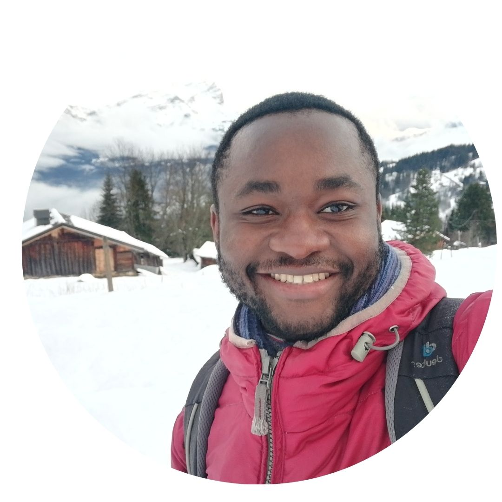

 
    </img>

- 👋 Hi, I'm **Daya**
- I'm a **data scientist** with a passion for soccer and basketball.
- This github portofolio is the way I share my passion for programming through languages:  
 **Python**, **R**, **SQL**, **Power BI** and **Excel VBA**.  
- I love working on topics of : Machine Learning, Web Scraping, APIs, Text Mining & NLP, Data Viz and Web App. ⭐

### Here's a little story
I was captivated by Denzel Washington's masterful portrayal of Robert McCall, embodying a solitary avenger in an unjust world, which struck a deep chord within me. The film's intense action sequences and the overarching theme of fighting against injustice not only kept me on the edge of my seat but also left a lasting impression of satisfaction and inspiration.  

So why don't you just watch [my movie](https://en.wikipedia.org/wiki/The_Equalizer_(film)) and it will answer **all** your questions.  

---

Here's my github profile.

<iframe width="600" height="450" src="https://github.com/smdlabtech" frameborder="0" style="border:0" allowfullscreen sandbox="allow-storage-access-by-user-activation allow-scripts allow-same-origin allow-popups allow-popups-to-escape-sandbox"></iframe>  

[Open in brownser](https://github.com/smdlabtech?tab=repositories).  